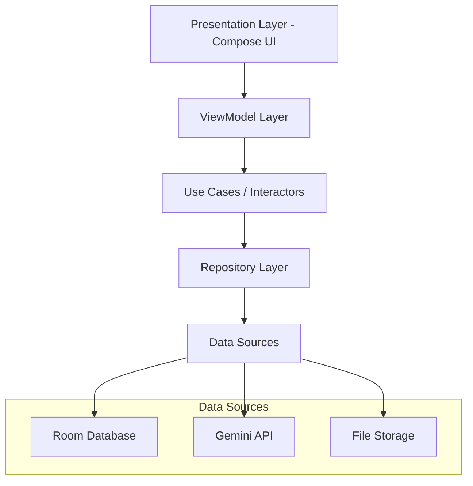

# Design Document

## Overview

The Lansones Disease Scanner is an Android application built with Kotlin and Jetpack Compose that provides AI-powered disease detection for lansones fruit and leaves. The app integrates with Google's Gemini API for image analysis and uses Room database for local storage. The architecture follows MVVM pattern with clean architecture principles to ensure maintainability and testability.

## Architecture

### High-Level Architecture



### Layer Responsibilities

- **Presentation Layer**: Jetpack Compose UI components, ViewModels
- **Domain Layer**: Use cases, business logic, domain models
- **Data Layer**: Repositories, data sources, API clients, database

## Components and Interfaces

### 1. Navigation Component

**Bottom Navigation Structure:**
- Dashboard: Overview and quick actions
- Analysis: Camera/upload and analysis flow
- History: Scan history with filtering
- Settings: App configuration

**Navigation Implementation:**
```kotlin
sealed class Screen(val route: String) {
    object Dashboard : Screen("dashboard")
    object Analysis : Screen("analysis")
    object History : Screen("history")
    object Settings : Screen("settings")
}
```

### 2. Analysis Flow Components

**Analysis Type Selection:**
- Fruit Analysis Mode
- Leaf Analysis Mode
- Visual indicators for each type

**Image Capture/Upload:**
- Camera integration using CameraX
- Gallery picker using Activity Result API
- Image preview and confirmation
- Image validation and preprocessing

**Analysis Processing:**
- Loading states with progress indicators
- Real-time status updates
- Error handling and retry mechanisms

### 3. Data Models

**Core Domain Models:**

```kotlin
data class ScanResult(
    val id: String,
    val imagePath: String,
    val analysisType: AnalysisType,
    val diseaseDetected: Boolean,
    val diseaseName: String?,
    val confidenceLevel: Float,
    val recommendations: List<String>,
    val timestamp: Long,
    val metadata: ScanMetadata
)

enum class AnalysisType {
    FRUIT, LEAVES
}

data class ScanMetadata(
    val imageSize: Long,
    val imageFormat: String,
    val analysisTime: Long,
    val apiVersion: String
)
```

**Database Entities:**

```kotlin
@Entity(tableName = "scan_results")
data class ScanResultEntity(
    @PrimaryKey val id: String,
    val imagePath: String,
    val analysisType: String,
    val diseaseDetected: Boolean,
    val diseaseName: String?,
    val confidenceLevel: Float,
    val recommendations: String, // JSON serialized
    val timestamp: Long,
    val imageSize: Long,
    val imageFormat: String,
    val analysisTime: Long,
    val apiVersion: String
)
```

### 4. Repository Pattern

**ScanRepository Interface:**
```kotlin
interface ScanRepository {
    suspend fun analyzeLansonesImage(
        imageUri: Uri, 
        analysisType: AnalysisType
    ): Result<ScanResult>
    
    suspend fun saveScanResult(scanResult: ScanResult): Result<Unit>
    suspend fun getAllScans(): Flow<List<ScanResult>>
    suspend fun getScanById(id: String): ScanResult?
    suspend fun deleteScan(id: String): Result<Unit>
    suspend fun clearAllScans(): Result<Unit>
}
```

### 5. Gemini API Integration

**API Client Structure:**
```kotlin
class GeminiApiClient {
    private val apiKey: String = BuildConfig.GEMINI_API_KEY
    private val client = OkHttpClient()
    
    suspend fun analyzeImage(
        imageBytes: ByteArray,
        analysisType: AnalysisType
    ): GeminiResponse
}
```

**Prompt Engineering:**
- Fruit Analysis Prompt: Focus on fruit surface diseases, ripeness, quality
- Leaf Analysis Prompt: Focus on leaf diseases, pest damage, nutrient deficiencies
- Structured response format for consistent parsing

### 6. Image Management

**Image Storage Strategy:**
- Store original images in app's private external storage
- Generate thumbnails for list views
- Implement image compression for API calls
- Clean up orphaned images

**File Structure:**
```
/Android/data/com.app.lansonescanner/files/
├── images/
│   ├── originals/
│   └── thumbnails/
└── cache/
```

## Data Models

### Database Schema

**ScanResults Table:**
- Primary key: UUID string
- Foreign key relationships: None (single table design)
- Indexes: timestamp, analysisType, diseaseDetected

**Room Database Configuration:**
```kotlin
@Database(
    entities = [ScanResultEntity::class],
    version = 1,
    exportSchema = false
)
@TypeConverters(Converters::class)
abstract class LansonesDatabase : RoomDatabase() {
    abstract fun scanDao(): ScanDao
}
```

### API Response Models

**Gemini API Response:**
```kotlin
data class GeminiResponse(
    val candidates: List<Candidate>
)

data class Candidate(
    val content: Content
)

data class Content(
    val parts: List<Part>
)

data class Part(
    val text: String
)
```

## Error Handling

### Error Categories

1. **Network Errors**: API connectivity issues
2. **API Errors**: Gemini API rate limits, invalid responses
3. **Storage Errors**: Database operations, file I/O
4. **Camera Errors**: Permission denied, hardware issues
5. **Validation Errors**: Invalid image formats, corrupted files

### Error Handling Strategy

```kotlin
sealed class AppError {
    object NetworkError : AppError()
    object ApiRateLimitError : AppError()
    object StorageError : AppError()
    object CameraPermissionError : AppError()
    object InvalidImageError : AppError()
    data class UnknownError(val message: String) : AppError()
}
```

### User-Friendly Error Messages

- Network issues: "Please check your internet connection"
- API limits: "Analysis service temporarily unavailable"
- Storage issues: "Unable to save scan results"
- Camera issues: "Camera permission required"

## Testing Strategy

### Unit Testing

**Test Coverage Areas:**
- ViewModels: Business logic, state management
- Use Cases: Domain logic, data transformation
- Repositories: Data operations, API integration
- Utilities: Image processing, validation

**Testing Tools:**
- JUnit 5 for unit tests
- MockK for mocking
- Turbine for Flow testing
- Robolectric for Android components

### Integration Testing

**Database Testing:**
- Room database operations
- Data migration scenarios
- Concurrent access patterns

**API Testing:**
- Gemini API integration
- Response parsing
- Error scenarios

### UI Testing

**Compose Testing:**
- Screen navigation
- User interactions
- State changes
- Accessibility compliance

**Testing Tools:**
- Compose Test Rule
- Espresso for complex interactions
- Screenshot testing for visual regression

### Performance Testing

**Areas to Monitor:**
- Image processing performance
- Database query optimization
- Memory usage during analysis
- Battery consumption

## UI/UX Design Specifications

### Design System

**Material Design 3 Implementation:**
- Dynamic color theming
- Adaptive layouts for different screen sizes
- Consistent elevation and shadows
- Proper touch targets (48dp minimum)

**Color Scheme:**
- Primary: Green tones (representing healthy plants)
- Secondary: Orange/amber (representing caution/disease)
- Error: Red (representing severe disease)
- Surface variants for cards and containers

### Screen Layouts

**Dashboard Screen:**
- Hero section with scan statistics
- Recent scans carousel
- Quick action floating action buttons
- Empty state with onboarding guidance

**Analysis Screen:**
- Analysis type selector (segmented control)
- Large image capture/upload area
- Progress indicators during analysis
- Results display with visual disease indicators

**History Screen:**
- Filterable list with search
- Card-based layout with thumbnails
- Swipe actions for delete/share
- Infinite scroll with pagination

**Settings Screen:**
- Grouped settings with clear sections
- Storage management with visual indicators
- About section with app information

### Animations and Transitions

**Screen Transitions:**
- Shared element transitions for images
- Fade transitions between navigation tabs
- Slide animations for modal screens

**Micro-interactions:**
- Button press feedback
- Loading animations
- Success/error state animations
- Pull-to-refresh gestures

### Accessibility

**Compliance Requirements:**
- Content descriptions for all images
- Semantic labeling for interactive elements
- High contrast support
- Large text support
- Screen reader compatibility
- Keyboard navigation support

## Security Considerations

### API Key Management

- Store Gemini API key in BuildConfig
- Use ProGuard/R8 to obfuscate in release builds
- Implement key rotation strategy
- Monitor API usage and implement rate limiting

### Data Privacy

- Store all data locally on device
- No cloud backup of scan images
- Clear data on app uninstall
- Provide data export functionality

### Image Security

- Validate image file types and sizes
- Sanitize file paths
- Implement secure file deletion
- Prevent path traversal attacks

## Performance Optimization

### Image Processing

- Implement image compression before API calls
- Use appropriate image formats (WebP when possible)
- Lazy loading for image lists
- Background processing for analysis

### Database Optimization

- Implement proper indexing strategy
- Use pagination for large datasets
- Background database operations
- Periodic cleanup of old data

### Memory Management

- Proper image bitmap recycling
- Use of weak references where appropriate
- Monitor memory leaks with LeakCanary
- Implement proper lifecycle management

### Network Optimization

- Implement retry mechanisms with exponential backoff
- Cache API responses when appropriate
- Compress request payloads
- Monitor network usage